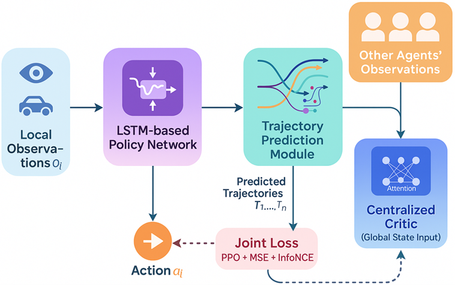
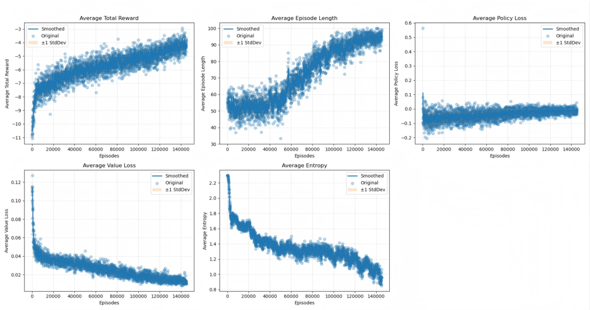
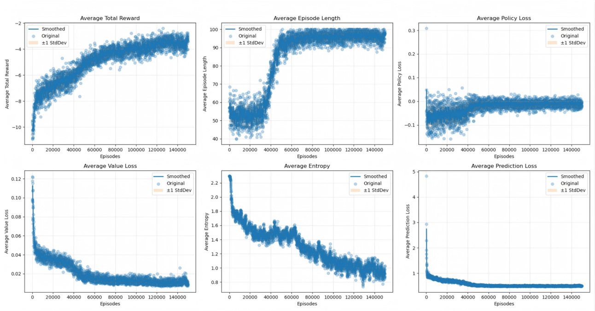

<div align="center">

# MAPPO + LSTM 轨迹预测

**基于 LSTM 辅助轨迹预测的多智能体近端策略优化**

<br/>

[](https://www.python.org/) [](https://pytorch.org/) [](LICENSE) [](https://doi.org/10.1145/3789982.3789990)

<br/>

中文文档 | **[English](README.md)**

> 发表于 **AICCC 2025** · DOI: [10.1145/3789982.3789990](https://doi.org/10.1145/3789982.3789990) · pp. 46–54

</div>

---

## 项目简介

标准 MAPPO 使用集中式 Critic 进行价值估计，但训练过程中忽略了未来轨迹信息。本工作为每个智能体的 Actor 网络附加了一个 **基于 LSTM 的轨迹预测头**，通过辅助预测损失引导模型学习更具前瞻性的状态表征。

核心思想：若智能体能准确预测队友未来若干步的位置，则其必然对环境形成了更深刻、更结构化的理解——这反过来会带来更好的协作策略。

## 主要贡献

| 版本 | 描述 |
|---|---|
| **基线 MAPPO** | 标准 MAPPO，集中式 Critic + 独立 Actor |
| **MAPPO + Linear** | Actor 附加线性轨迹预测头（`pred_steps=3`）|
| **MAPPO + LSTM v1** | LSTM 预测头 + MSE 辅助损失 |
| **MAPPO + LSTM v2** | LSTM 预测头 + MSE + InfoNCE 对比损失 |
| **MAPPO + LSTM（完整）** | LSTM + 智能体间多头自注意力 + InfoNCE 损失 |

## 网络结构

<div align="center">

</div>

```
Actor（策略网络 PolicyNet）
├── 全连接层 ────────────────────► 动作分布（策略头）
└── LSTM + 多头注意力 ────────────► 未来状态预测（辅助头）
        ↑
   初始化自共享 FC 嵌入

集中式 Critic（CentralValueNet）
└── 所有智能体状态拼接 [team_size × state_dim] ──► 每智能体价值估计
```

辅助损失为 MSE 重建损失与 InfoNCE 对比损失的加权组合：

```
L_total = L_PPO + α · (L_MSE + β · L_InfoNCE)
```

## 实验环境

- **框架**：[ma-gym](https://github.com/koulanurag/ma-gym) Combat
- **任务**：20×20 网格上的 5v5 团队对战
- **观测**：每智能体局部偏观测
- **动作空间**：离散，5 个动作

## 项目结构

```
MAPPO-LSTM-Trajectory/
├── src/
│   ├── mappo/
│   │   └── train.py              # 基线 MAPPO 训练
│   └── mappo_lstm/
│       ├── train_linear.py       # MAPPO + 线性预测头
│       ├── train_lstm_v1.py      # MAPPO + LSTM（MSE 损失）
│       ├── train_lstm_v2.py      # MAPPO + LSTM（MSE + InfoNCE）
│       └── train_lstm.py         # 完整模型（LSTM + 注意力）
├── results/
│   ├── mappo/                    # 基线训练日志与曲线图
│   └── mappo_lstm/               # LSTM 模型训练日志与曲线图
├── weights/
│   ├── mappo/                    # 基线模型权重
│   └── mappo_lstm/               # LSTM 模型权重
├── requirements.txt
├── README.md                     # 英文文档
└── README_ZH.md                  # 本文件（中文）
```

## 安装

```bash
pip install -r requirements.txt
```

ma-gym 需从源码安装（未发布至 PyPI）：

```bash
git clone https://github.com/koulanurag/ma-gym.git
cd ma-gym && pip install -e .
```

## 使用方法

**训练基线 MAPPO：**
```bash
cd src/mappo
python train.py
```

**训练完整 MAPPO + LSTM 模型：**
```bash
cd src/mappo_lstm
python train_lstm.py
```

训练日志写入 `training_log_metrics_weight*.txt`，曲线图保存在 `plots_metrics_weight/` 目录下。

## 超参数

| 参数 | 值 |
|---|---|
| Actor 学习率 | 3e-4 |
| Critic 学习率 | 1e-3 |
| 隐藏层维度 | 64 |
| 折扣因子 γ | 0.99 |
| GAE 参数 λ | 0.97 |
| PPO 截断系数 ε | 0.3 |
| 队伍规模 | 5 |
| 预测步数 | 5 |
| 辅助损失权重 α | 0.1 |
| InfoNCE 温度系数 τ | 0.07 |

## 实验结果

`results/` 目录下包含基线 MAPPO 与 MAPPO+LSTM 的训练曲线对比。LSTM 增强模型在 5v5 对战任务中表现出更高的累积奖励与更快的收敛速度。

<div align="center">

| 基线 MAPPO | MAPPO + LSTM（5v5）|
|:---:|:---:|
|  |  |

</div>

## 引用

如使用本代码，请引用：

```bibtex
@inproceedings{ji2025mappo,
  title     = {MAPPO with LSTM Trajectory Prediction for Cooperative Multi-Agent Combat},
  author    = {Ji, Jun},
  booktitle = {Proceedings of the 2025 8th International Conference on Algorithms, Computing and Artificial Intelligence (AICCC '25)},
  pages     = {46--54},
  year      = {2025},
  doi       = {10.1145/3789982.3789990},
  publisher = {ACM}
}
```

## 许可证

[MIT](LICENSE)
